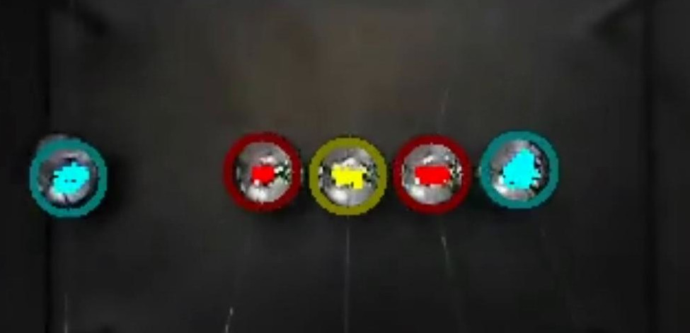

# VideoProcessor
An image processor which looks for markers and tracks then over the course of a video. Intended for a Newton's cradle.

The program has hard-coded colours which are tracked over time, then analysed using `Python` where the motion is then reformatted so that position relative to each marker's equillibrium position can be acquired.

The processor expects either different colours for each of the markers, or a mirrored colouring with the central sphere (if it exists) having a unique colour.

 

## Output of VideoProcessor
### Output Data
The video processor runs a python data analysis after it completes, and returns information about the motion of the markers, as well as converting the absolute postion (in pixels) to the displacement from equillibrium (in metres).

The below graph shows that initially just the outside spheres on the Newton's cradle are moving, but after a few oscillations, all the balls move in sync with each other: this is linear dispersion.

_1-displacements.jpg)

The next graph is the plot of energy which can be acquired by differentiating the motion data over time, and multiplying by some constants.
It can be used to show the rate at which the energy decays, and from this exponent other physical properties can be found, such as the elasticity of the cradle's spheres.

_1-energies.jpg)

 

### Output Video
The video proccessor outputs a modified video for visual validation that the algorithm has proceeded correctly.
Each marker is highlighted and a radius around their centroid is given by calculating the offset between each marker's equillibrium positions.

